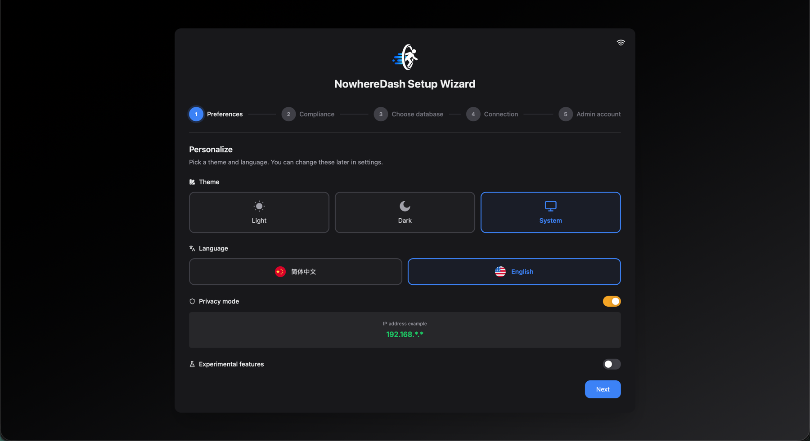
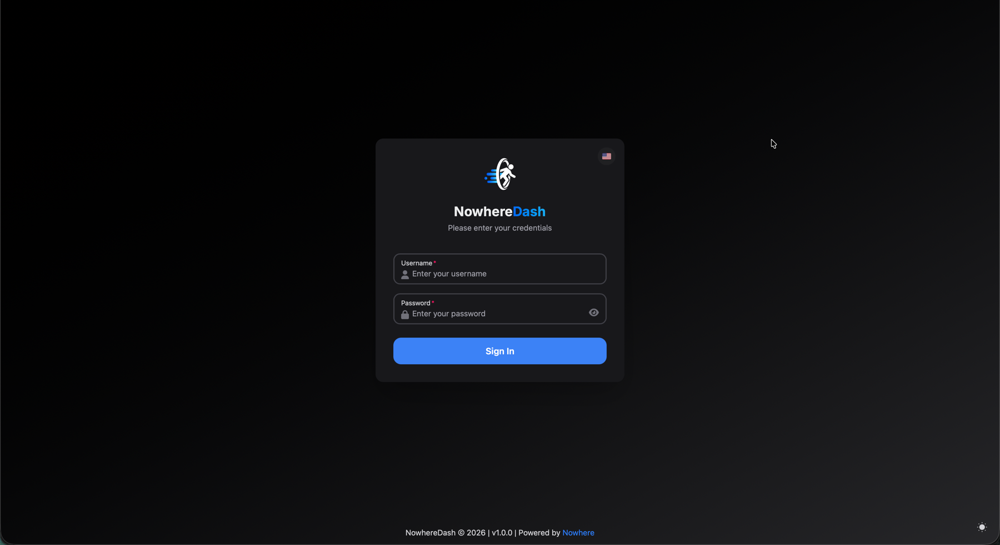
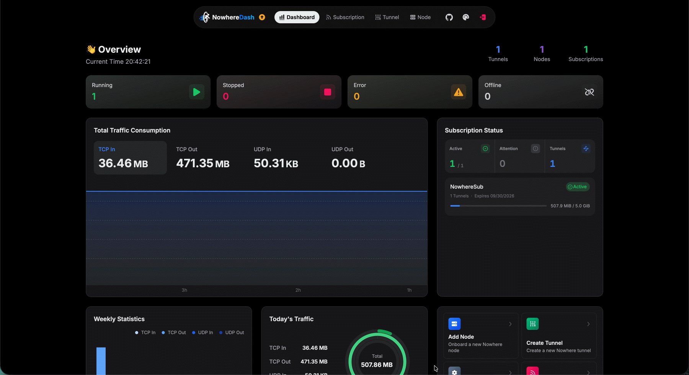
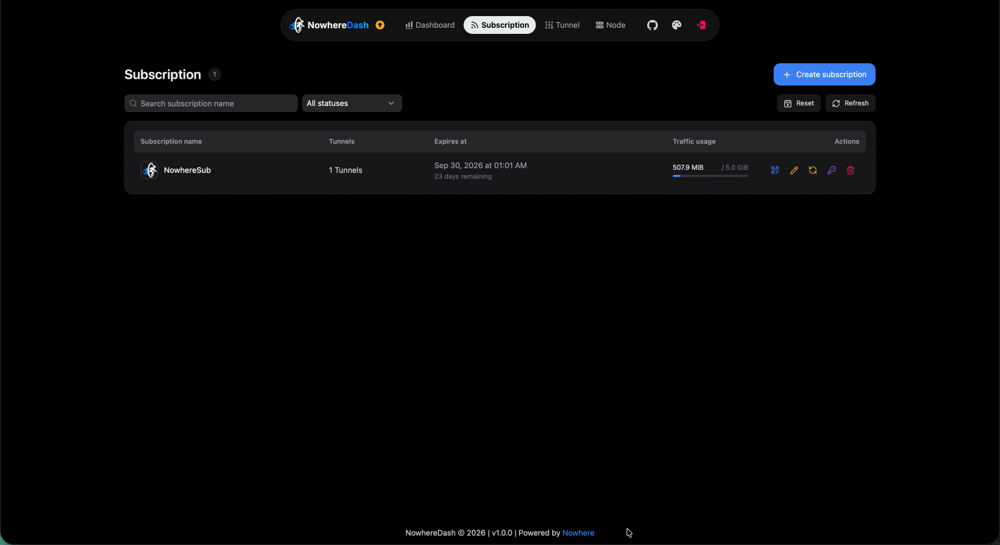
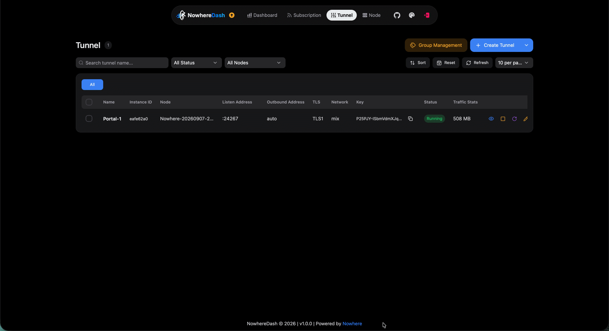
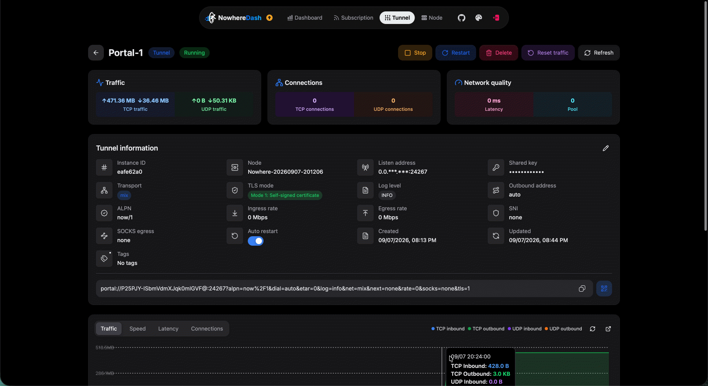
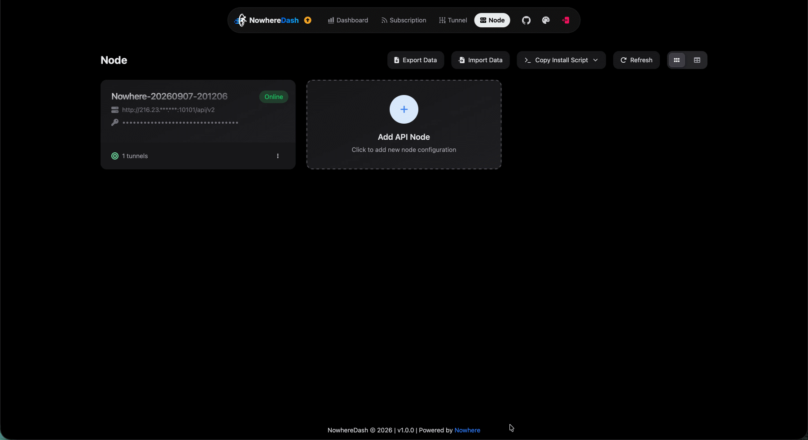
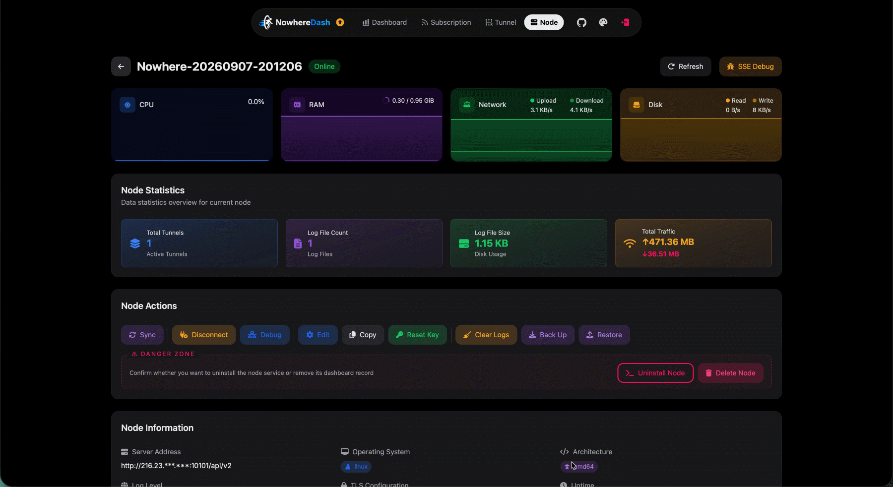
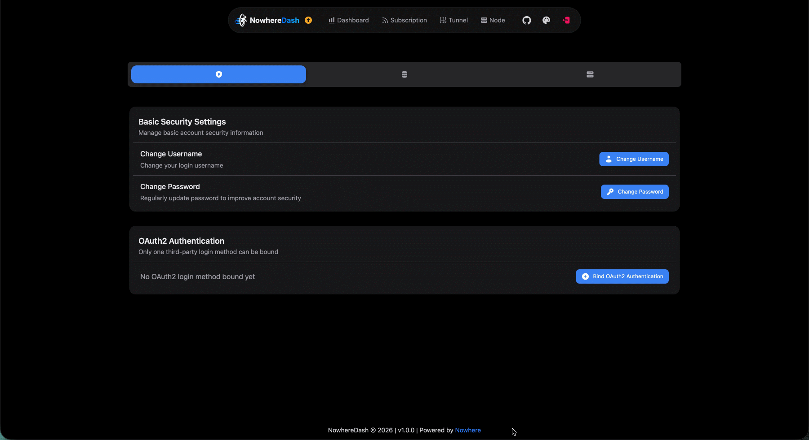

<div align="center">
  

  <h1>NowhereDash</h1>

  <p><strong>A focused control plane for Nowhere Portal infrastructure.</strong></p>
  <p>Manage multiple OpenCtrl endpoints, operate Portal instances, inspect live telemetry, and publish private subscriptions from one dashboard.</p>

  <p>
    <a href="LICENSE"></a>
    <a href="https://github.com/NodePassProject/NowhereDash/releases"></a>
    <a href="https://github.com/NodePassProject/NowhereDash/releases"></a>
    <a href="https://github.com/NodePassProject/NowhereDash/pkgs/container/nowheredash"></a>
  </p>

  <p>
    <a href="#product-tour">Product Tour</a> ·
    <a href="#quick-start">Quick Start</a> ·
    <a href="#documentation">Documentation</a> ·
    <a href="#development">Development</a>
  </p>

  <p><strong>English</strong> · <a href="docs/zh-CN/README.md">简体中文</a></p>
</div>

NowhereDash ships as a single Go binary with an embedded React frontend. It uses Gin, GORM, and SQLite or PostgreSQL on the backend, with Vite, TypeScript, and HeroUI in the web application. Runtime state is delivered through SSE and WebSocket.

> [!IMPORTANT]
> NowhereDash manages Nowhere Portal instances only. Legacy client/server modes, service assembly, and compatibility fields from earlier dashboard formats are intentionally unsupported.

## At a Glance

| Area              | Highlights                                                             |
| ----------------- | ---------------------------------------------------------------------- |
| **Portals**       | Manage Portal instances across multiple OpenCtrl endpoints.            |
| **Observability** | Monitor traffic, connections, latency, status, and logs in real time.  |
| **Subscriptions** | Publish protected feeds with QR codes and mobile import links.         |
| **Security**      | Guided setup, OAuth2 login, TLS, and token rotation.                   |
| **Deployment**    | Run with Docker, systemd, or a standalone binary on SQLite/PostgreSQL. |

## Product Tour

|                                                                  |                                                       |                                                           |
| ---------------------------------------------------------------- | ----------------------------------------------------- | --------------------------------------------------------- |
|     |           |   |
|  |   |  |
|                  |  |              |

## Quick Start

Run the latest container:

```bash
mkdir -p db logs

docker run -d \
  --name nowheredash \
  --restart unless-stopped \
  -p 4000:4000 \
  -v "$(pwd)/db:/app/db" \
  -v "$(pwd)/logs:/app/logs" \
  ghcr.io/nodepassproject/nowheredash:latest
```

Open [http://localhost:4000](http://localhost:4000).

> [!TIP]
> On first start, the Setup wizard lets you choose SQLite or PostgreSQL, accept the compliance notice, and create the first administrator. It writes the resulting configuration to `.env`; restart the service afterward if your process manager does not do so automatically.

| Installation     | Guide                                       | Recommended for                 |
| ---------------- | ------------------------------------------- | ------------------------------- |
| Docker           | [Docker guide](docs/en/DOCKER.md)           | Containers and quick evaluation |
| Binary + systemd | [Binary guide](docs/en/BINARY.md)           | Long-running Linux hosts        |
| Source           | [Development guide](docs/en/DEVELOPMENT.md) | Contributors and custom builds  |

## Configuration

<details>
<summary><strong>Common CLI flags</strong></summary>

```bash
./nowheredash --help
./nowheredash --version
./nowheredash --port 4000
./nowheredash --log-level INFO
./nowheredash --cert /path/to/cert.pem --key /path/to/key.pem
./nowheredash --disable-login
./nowheredash --sse-debug-log
./nowheredash --disable-sse-log
./nowheredash --demo
./nowheredash --resetpwd
```

</details>

Common environment variables:

| Group          | Variables                                                                 |
| -------------- | ------------------------------------------------------------------------- |
| Server         | `PORT`, `LOG-LEVEL`, `TLS_CERT`, `TLS_KEY`                                |
| Authentication | `DISABLE_LOGIN`                                                           |
| Runtime        | `SSE_DEBUG_LOG`, `DISABLE_SSE_LOG`, `DEMO_MODE`                           |
| Database       | `DB_DRIVER`, `DB_PATH`, and the `PG_*` values written by the Setup wizard |

## Development

Requirements: Go 1.23+, Node.js 20+, and pnpm 10+.

```bash
cd web
corepack enable
corepack prepare pnpm@10.23.0 --activate
pnpm install --frozen-lockfile
pnpm build

cd ..
go run ./cmd/server
```

Validation and local frontend development:

```bash
go test ./...

cd web
pnpm dev
```

## Documentation

| Topic                         | Guide                                                  |
| ----------------------------- | ------------------------------------------------------ |
| Deployment with Docker        | [DOCKER.md](docs/en/DOCKER.md)                         |
| Binary and systemd deployment | [BINARY.md](docs/en/BINARY.md)                         |
| Development environment       | [DEVELOPMENT.md](docs/en/DEVELOPMENT.md)               |
| Migration                     | [MIGRATION.md](docs/en/MIGRATION.md)                   |
| Offline SQLite compaction     | [SQLITE-MAINTENANCE.md](docs/en/SQLITE-MAINTENANCE.md) |

## Compatibility

NowhereDash uses a Portal-only schema and backup format. Recreate legacy dashboard instances as Nowhere Portal instances, or import a NowhereDash Portal-only backup.

## License and Support

NowhereDash is licensed under the [GNU General Public License v3.0](LICENSE).

| Resource | Link                                                                                        |
| -------- | ------------------------------------------------------------------------------------------- |
| Issues   | [NodePassProject/NowhereDash/issues](https://github.com/NodePassProject/NowhereDash/issues) |
| Nowhere  | [NodePassProject/Nowhere](https://github.com/NodePassProject/Nowhere)                       |
| OpenCtrl | [NodePassProject/OpenCtrl](https://github.com/NodePassProject/OpenCtrl)                     |

<details>
<summary><strong>Disclaimer</strong></summary>

This project is provided "as is", without any express or implied warranties. You are responsible for complying with local laws and regulations and using it only for lawful purposes. The authors are not liable for any direct, indirect, incidental, or consequential damages. The authors reserve the right to modify features and this statement at any time.

</details>

<div align="center">
  <sub>Copyright 2026 NodePassProject.</sub>
</div>
