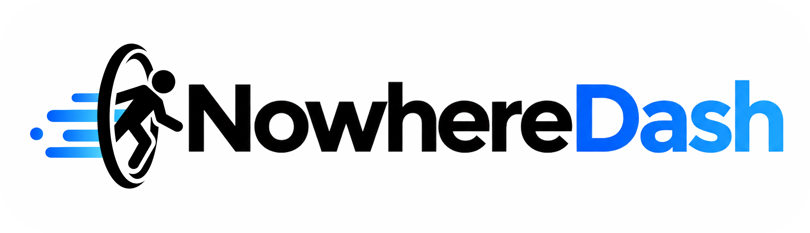

<div align="center">
  

  <h1>NowhereDash</h1>

  <p><strong>专注于 Nowhere Portal 基础设施的统一控制面板。</strong></p>
  <p>在一个面板中管理多个 OpenCtrl 端点、操作 Portal 实例、查看实时状态并发布私有订阅。</p>

  <p>
    <a href="../../LICENSE"></a>
    <a href="https://github.com/NodePassProject/NowhereDash/releases"></a>
    <a href="https://github.com/NodePassProject/NowhereDash/releases"></a>
    <a href="https://github.com/NodePassProject/NowhereDash/pkgs/container/nowheredash"></a>
  </p>

  <p>
    <a href="#快速开始">快速开始</a> ·
    <a href="#portal-订阅">Portal 订阅</a> ·
    <a href="#文档">文档</a> ·
    <a href="#开发构建">开发构建</a>
  </p>

  <p><a href="../../README.md">English</a> · <strong>简体中文</strong></p>
</div>

NowhereDash 以单个 Go 二进制发布，并内嵌 React 前端。后端采用 Gin、GORM 和 SQLite 或 PostgreSQL，Web 应用采用 Vite、TypeScript 与 HeroUI，运行状态通过 SSE 和 WebSocket 实时传递。

> [!IMPORTANT]
> NowhereDash 仅管理 Nowhere Portal 实例。旧版 client/server 模式、服务组装功能和历史面板兼容字段均不再支持。

## 能力概览

| 领域                | NowhereDash 提供的能力                                                                              |
| ------------------- | --------------------------------------------------------------------------------------------------- |
| **Portal 生命周期** | 创建、编辑、启动、停止、重启、重命名、排序和监控 `portal://` 实例。                                 |
| **OpenCtrl 端点**   | 在一个面板中管理多个 OpenCtrl `/api/v2` 端点。                                                      |
| **完整编辑器**      | 配置网络模式、TLS、证书、ALPN、速率限制、拨号、SOCKS、Next Hop、载波、连接池、SNI、Pin 和日志级别。 |
| **实时运维**        | 通过 SSE 和 WebSocket 展示状态、流量、连接数、延迟和日志。                                          |
| **运维数据**        | 查看运行指标、清理历史数据，并在维护窗口执行 SQLite 停服压缩。                                      |
| **托管订阅**        | 将运行中的 Portal 发布为 Token 鉴权订阅，支持到期时间、流量限制、预览和 Token 轮换。                |
| **安全控制**        | 使用初始化向导、密码重置、OAuth2-only 登录、TLS 和订阅 Token 轮换。                                 |
| **灵活部署**        | 使用 Docker、systemd 或单二进制运行，并可在浏览器中初始化 SQLite 或 PostgreSQL。                    |
| **移动端工作流**    | 生成二维码、`nowhere://` URL 和 `anywhere://add-proxy` 导入链接。                                   |

OpenCtrl Metadata 会被完整保留：`meta.tags` 和 `meta.peer` 独立于 Portal URL 存储。

## 快速开始

运行最新容器：

```bash
mkdir -p db logs

docker run -d \
  --name nowheredash \
  --restart unless-stopped \
  -p 4000:4000 \
  -v "$(pwd)/db:/app/db" \
  -v "$(pwd)/logs:/app/logs" \
  ghcr.io/nodepassproject/nowheredash:latest
```

打开 [http://localhost:4000](http://localhost:4000)。

> [!TIP]
> 首次启动时，Setup 向导会引导你选择 SQLite 或 PostgreSQL、确认合规声明并创建第一个管理员，最终配置会写入 `.env`；如果进程管理器不会自动重启，请在初始化完成后手动重启服务。

| 安装方式         | 指南                       | 适用场景              |
| ---------------- | -------------------------- | --------------------- |
| Docker           | [Docker 部署](DOCKER.md)   | 容器环境与快速体验    |
| 二进制 + systemd | [二进制部署](BINARY.md)    | 长期运行的 Linux 主机 |
| 源码             | [开发环境](DEVELOPMENT.md) | 参与开发与自定义构建  |

## Portal 订阅

订阅菜单可将选定的 Portal 发布为 `/sub/portal?token=...`。每次请求都会根据当前运行中的 Portal 状态实时生成内容，并返回一条或多条 `nowhere://` URL。

订阅支持到期时间、流量上限、传输偏好、流量重置、正文预览、Token 轮换、明暗主题图标，以及通过 `anywhere://add-proxy` 一键导入 Anywhere。

> [!WARNING]
> 订阅 URL 属于 Bearer Secret。生产环境应使用 HTTPS，并在反向代理、CDN 和可观测性日志中隐藏 `token` 查询参数。

## 配置

<details>
<summary><strong>常用命令行参数</strong></summary>

```bash
./nowheredash --help
./nowheredash --version
./nowheredash --port 4000
./nowheredash --log-level INFO
./nowheredash --cert /path/to/cert.pem --key /path/to/key.pem
./nowheredash --disable-login
./nowheredash --sse-debug-log
./nowheredash --disable-sse-log
./nowheredash --demo
./nowheredash --resetpwd
```

</details>

常用环境变量：

| 分类     | 变量                                                      |
| -------- | --------------------------------------------------------- |
| 服务     | `PORT`、`LOG-LEVEL`、`TLS_CERT`、`TLS_KEY`                |
| 身份验证 | `DISABLE_LOGIN`                                           |
| 运行状态 | `SSE_DEBUG_LOG`、`DISABLE_SSE_LOG`、`DEMO_MODE`           |
| 数据库   | `DB_DRIVER`、`DB_PATH`，以及 Setup 向导写入的 `PG_*` 变量 |

## 开发构建

需要 Go 1.23+、Node.js 20+ 和 pnpm 10+。

```bash
cd web
corepack enable
corepack prepare pnpm@10.23.0 --activate
pnpm install --frozen-lockfile
pnpm build

cd ..
go run ./cmd/server
```

运行测试和前端开发服务：

```bash
go test ./...

cd web
pnpm dev
```

## 文档

| 主题                  | 指南                                           |
| --------------------- | ---------------------------------------------- |
| Docker 部署           | [DOCKER.md](DOCKER.md)                         |
| 二进制与 systemd 部署 | [BINARY.md](BINARY.md)                         |
| 开发环境              | [DEVELOPMENT.md](DEVELOPMENT.md)               |
| 迁移                  | [MIGRATION.md](MIGRATION.md)                   |
| SQLite 停服压缩       | [SQLITE-MAINTENANCE.md](SQLITE-MAINTENANCE.md) |

## 数据兼容性

NowhereDash 使用 Portal-only 数据模型和备份格式。旧面板中的实例需要按 Nowhere Portal 重新创建，或导入 NowhereDash 的 Portal-only 备份。

## 许可证与支持

NowhereDash 使用 [GNU General Public License v3.0](../../LICENSE) 许可证。

| 资源     | 链接                                                                                        |
| -------- | ------------------------------------------------------------------------------------------- |
| Issues   | [NodePassProject/NowhereDash/issues](https://github.com/NodePassProject/NowhereDash/issues) |
| Nowhere  | [NodePassProject/Nowhere](https://github.com/NodePassProject/Nowhere)                       |
| OpenCtrl | [NodePassProject/OpenCtrl](https://github.com/NodePassProject/OpenCtrl)                     |

<details>
<summary><strong>免责声明</strong></summary>

本项目按“现状”提供，不附带任何明示或暗示担保。使用者需自行遵守所在地法律法规，并仅将其用于合法用途。作者不对任何直接、间接、偶发或后果性损失承担责任，并保留随时调整功能和声明的权利。

</details>

<div align="center">
  <sub>Copyright 2026 NodePassProject.</sub>
</div>
